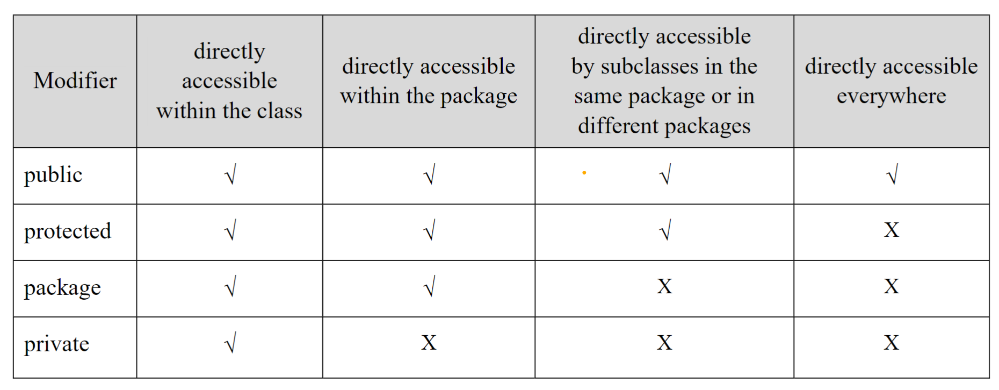

A class is an abstract data type which is distinct from primitive data types.

- It is a blueprint (or an abstraction) for an object.

- Methods are operations related to your data.

- Class methods are operations related to the data within the class or data provided to the object via parameters.

**As a Java developer you goal is to expand and extend the code in the Java framework to fit your goal.**

---

## equals() method

Last time we went over the difference between comparing objects with the `==` vs the `equals()` method.

We will go over some code that further highlights the necessity of overriding and using the `equals()` method.

## compareTo() method

The `compareTo()` method is used to compare two objects and determine which one is "greater" or "less" than the other.

- **This method is key to sorting data in a particular order**

---

Instance variables are visible within the class, local variables are visible within the method.

- We always use the `@Override` tag to catch errors during compilation time (so we avoid accidently overloading when we meant to override).

If you create your own class (not one that the Java framework provides) it is best to always do these things:

1. Define a null argument constructor
2. Override the `equals()` method
3. Override the `toString()` method
4. Override the `compareTo()` method

The `Date()` class that I used in today's ecample code is Java's built in Date class **BUT WE WILL BE CODING OUR OWN DATE CLASS FOR PROJECT 1**.

**Project 1 will involve using about or more than 10 of our own classes.**

- Always test each class independently before testing them together.

---

## Visibility Modifiers

Below is an image of the different visibility modifiers in Java.



**What if you do not use any of these keywords?**

- Then Java's default visibility is `package` level

**What is the difference between `package` and `protected` modifiers?**

- Suppose you have a parent class in one package and a child class in another package. If you use the `protected` modifier for your instance variables or methods in your parent class then you will be able to use those variables and methods in your child class (even though it is in a different package).

- This will not be the case if the variables and methods are given the `package` modifier instead.

---

## Static variables, constants, and methods

A static variable is one that is shared by all objects of the class.

- **It is a way to save on memory overhead because by defining this variable once, every time we create an object with this static variable it does not get recreated. (Since all objects share the same variable)**

Compare this to typical **instance variables** such as the `radius` for a `Circle` object. Different circles will have different radii, so each time we create a circle object it makes sense to allot memory to a different radius.

- **`PI`** the constant should always be defined as a static variable because its value does not change regardless of application!

---

## Wrapper Classes and Autoboxing

- Why would we want to convert a primitive type to an object?

Suppose we made an integer variable but I wanted a way to convert it into a binary number.

Option 1: Make your own method to convert an integer into a binary number.

Option 2: Use the `Integer.toBinaryString()` method to convert an integer into a binary number.

**In the second option the `Integer` class that we use is considered a wrapper class.**

And because of this there is techincally a third option: we can create an `Integer` object by passing a primitive to the `Integer()` constructor and then give it a name.

```java

Integer five = new Integer(5);

System.out.println(five.toBinaryString());

```

**The con of using such a wrapper class is that it creates an immutable object. That means that once the objects are created, their internal states cannot be changed.**

---

## Immutable Objects and Classes

Suppose for some reason you wanted to create an object whose contents cannot be changed after instantiation. Such an object is called an **immutable object** and its class is called an **immutable class**.

- One example is the `String` class and its objects.

Here are the conditions that must be met to ensure that a class is immutable:

1. All instance variables must be private

2. There cannot be any setter methods (because they would be able to change the contents of the object)

3.**THIS IS MOST IMPORTANT** The class methods can never return a reference to one of the class's variables! Instead when it seems like you need to return a reference to one of the class's variables, you should return a copy of that variable or another representation of it.

Most people remember the first 2 conditions but do not remember to enforce the 3rd condition.

```java

public class Employee {
    private int id;
    private String name;
    private java.util.Date hired;
    
    public Employee (int id, String name) {
        this.id = id;
        this.name = name;
        hired = new java.util.Date();
    }
    
    public int getId() {
        return id;
    }
    
    public String getName() {
        return name;
    }

    //this method returns the reference to the calling method, thus is mutable.
    public java.util.Date getDateHired() {
        return hired;
    }
}

```

To fix the class above to be truly immutable:

```java

public class Employee {
    
    private int id;
    private String name;
    private java.util.Date hired;
    
    public Employee (int id, String name) {
        this.id = id;
        this.name = name;
        hired = new java.util.Date();
    }
    
    public int getId() {
        return id;
    }
    
    public String getName() {
        return name;
    }

    public java.util.Date getDateHired() {
        // Return a clone of the object or an alternative representation of it.
        return new java.util.Date(hired.getTime());
    }
}

```