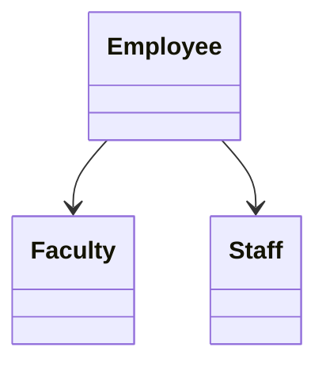
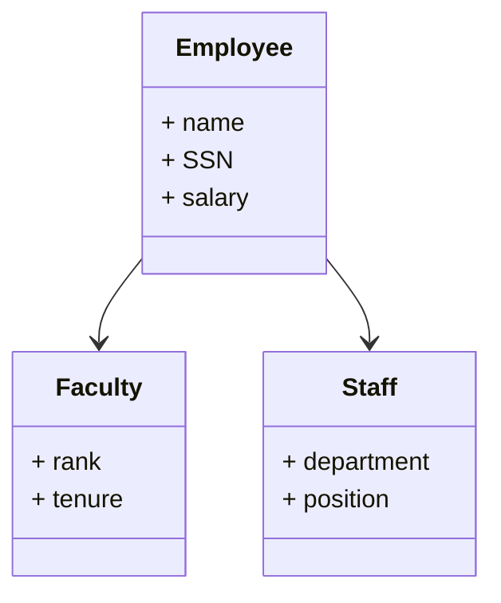

Runtime binding vs compile-time binding

Previously we talked about the fundamentals of OOP languages (i.e. encapsulation, inheritance, etc.).

1. Encapsulation
2. Information Hiding for APIs
3. Mapping objects to real world entities.

---

Today we will cover polymorphism, extendibililty, and reusability.

Below is a simple diagram of a payroll system that involves the Employee superclass,
which is differentiated into Faculty and Staff subclasses

What attributes should be common amongst all types of employees?

- name, SSN for example.

**It does not make sense to implement the `name` attribute in all three classes. So in OOP we remove this redundancy by only needing to declare the common feature in the superclass / parent class *Employee*.**

Here is a potential UML diagram that incorporates these design choices that are broadly enabled by the concept of "Extendibility".

The arrows represent the inheritance relationship between the superclass and subclasses.

- **Keep in mind that the constructor is not inherited because the constructor is a special method used to instaniate an object. If the constructor was of the same name as its superclass what would be the point?**

- **When you move up the inheritance tree we get more general, when we move down its more specific.**

- Staff and Faculty are sibling classes which implies that an employee cannot be both a Staff and a Faculty member.

When you say `Employee e = new Staff();` why?

This is because of polymorphism. The left hand side of this e