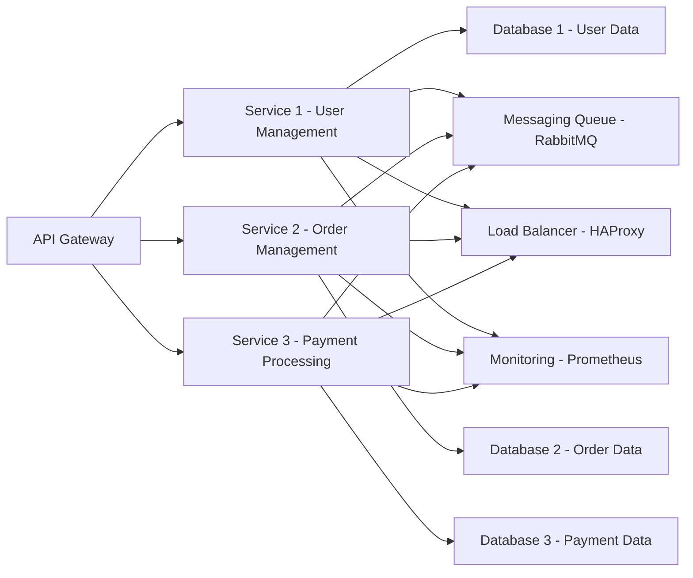
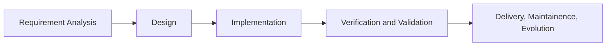

- Projects 1 and 2 will polish up your basic OOP and Java skills.

- Projects 3 and 4 will be JavaFX projects that emphasize GUI development in addition to OOP principled backend

- Project 5 is a mobile app that is developed with the help of Android Studio

Project 1 has very little freedom, we have to follow the specifications to a tee, but as we
progress through the projects we will have more freedom to make more custom apps.

**Final exam will be cumulative!**

**Recitation is not mandatory, nor is attending lecture.**

---

Software is abstract and intangible, has no physical limitations, can be arbitrary and complex, and is always changeable.
We can attempt to visualize or model software via diagrams (we will talk about UML diagrams later)!

Having no physical limitations is both an advantage and a vice!

- Without physical limitations it becomes very difficult to maintain software across many mediums or devices.

- However as new devices come out, if their underlying logical hardware mimics other hardware, cross-platform integration of software is possible
and feasible without rewriting the entire codebase.

- (ex. Operating Systems enable apps to run on plethora of devices with various hardware via some standardized underlying interface).

With less limitations on software it is more easy to ignore or overlook security concerns!

Look up NASA programming standards if you want to see how security is enforced on several levels for projects that involve several hundreds of millions
of dollars of infrastructure and potential human risk!

---

## Complexity

The human factor in software development may result in miscommunications. This is why it is more
important than ever to consult people from various disciplines to check the functionality of your
software.

- Spaghetti code is the aftermath of creating iterative changes that layer complexity over
many years of operation.

- This is why a component based, modular, or microservice approach to application development is preferred.

Below is an example of Microservice architecture

---

## Changeability

Software must evolve to remain useful.

- Discovered errors must be noted and fixed and retested for!

- Software is cheap and easy to change as opposed to hardware.

- The time between technological changed may often be shorter than the duration of a project, which causes project requirements to change.

---

## What is Software Methodology?

Software methodology includes methods and practices for developing quality software.

We define the quality of the software based on:

- Maintenability (backend)
- Dependability and Security (backend)
- Efficiency (not that important for this class)
- Usability and Acceptability (frontend design, UI/UX, etc.)

---

## Software Development Lifecycle

- Never claim your software is spot-clean.

**The only way you can confidently claim this is if you exhaustively test each part of your software. But you have limited time and resources!**

**Instead only cover and focus on a limited set of test cases!**

A software process model is an abstract representation of a software production process.

- Paradigms are generic process models that are used to manage software development.

Ex. Waterfall models (sequential flow, plan driven), Incremental models (parallel flow, spiral, AGILE models)

---

## Coding standards in this class

1) Code should be able to be understood by other developers other than the original author.

2) Should enable easy development of test cases.

3) Have minimal dependencies (loosely coupled) and provide a clean and minimal API.

4) Each function / method should ideally perform a single task (for easy reusability, testing, and debugging).

### **Here are the standards within this class that will help us obtain these goals**

- Each class and method should have comments in **Javadoc** format.
- Code should be appropriately indented and lined up
- Names for classes, methods, constants, and variables should be self-explanatory and descriptive (with a few exceptions).
- NO MAGIC NUMBERS (if a specific number in the code is used several times it should be initialized and used with a descriptive name)

**A magic number is a numeric value that remains unchanged during the course of a program and is used directly
in the code without a name.**

- Methods should only perform a single task which should ideally keep them short!

- A long method indicates that method may be doing too much and shoudl be a sign to split it up.

---

## Agile Manifesto

- Adapt software changes better (which is to say set up a system for efficent updates to software)

- Change the software frequently (more deliveries). This is enabled via a continuous integration and continuous delivery (CI/CD) pipeline.

- Popular Agile practices include: XP (eXtreme Programming), Scrum, Kanban, e.t.c.

---

## Skipped Pair Programming, lets talk about the important stuff: GITHUB in the next class!

