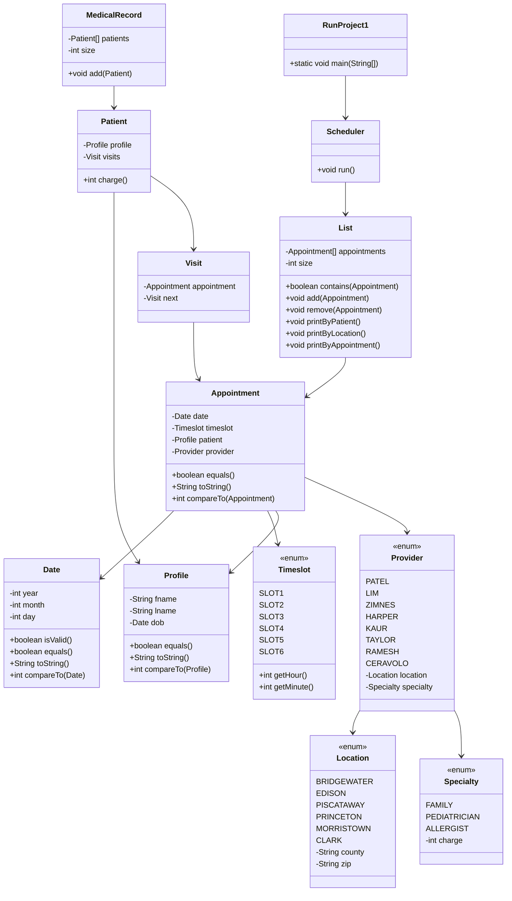

```mermaid

classDiagram
    class Appointment {
        -Date date
        -Timeslot timeslot
        -Profile patient
        -Provider provider
        +boolean equals()
        +String toString()
        +int compareTo(Appointment)
    }

    class Date {
        -int year
        -int month
        -int day
        +boolean isValid()
        +boolean equals()
        +String toString()
        +int compareTo(Date)
    }

    class Profile {
        -String fname
        -String lname
        -Date dob
        +boolean equals()
        +String toString()
        +int compareTo(Profile)
    }

    class Timeslot {
        <<enum>>
        SLOT1
        SLOT2
        SLOT3
        SLOT4
        SLOT5
        SLOT6
        +int getHour()
        +int getMinute()
    }

    class Provider {
        <<enum>>
        PATEL
        LIM
        ZIMNES
        HARPER
        KAUR
        TAYLOR
        RAMESH
        CERAVOLO
        -Location location
        -Specialty specialty
    }

    class Location {
        <<enum>>
        BRIDGEWATER
        EDISON
        PISCATAWAY
        PRINCETON
        MORRISTOWN
        CLARK
        -String county
        -String zip
    }

    class Specialty {
        <<enum>>
        FAMILY
        PEDIATRICIAN
        ALLERGIST
        -int charge
    }

    class List {
        -Appointment[] appointments
        -int size
        +boolean contains(Appointment)
        +void add(Appointment)
        +void remove(Appointment)
        +void printByPatient()
        +void printByLocation()
        +void printByAppointment()
    }

    class Patient {
        -Profile profile
        -Visit visits
        +int charge()
    }

    class Visit {
        -Appointment appointment
        -Visit next
    }

    class MedicalRecord {
        -Patient[] patients
        -int size
        +void add(Patient)
    }

    class Scheduler {
        +void run()
    }

    class RunProject1 {
        +static void main(String[])
    }

    Appointment --> Date
    Appointment --> Timeslot
    Appointment --> Profile
    Appointment --> Provider
    Provider --> Location
    Provider --> Specialty
    Patient --> Profile
    Patient --> Visit
    MedicalRecord --> Patient
    Visit --> Appointment
    List --> Appointment
    Scheduler --> List
    RunProject1 --> Scheduler


```